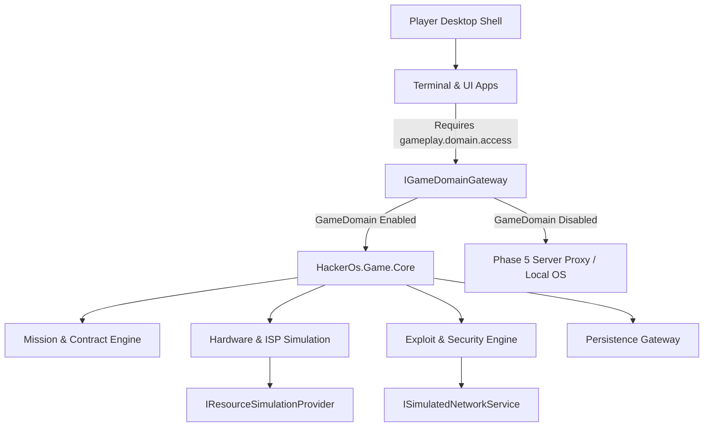

# Gameplay V3 Domain Analysis & Architectural Specifications

## Overview

This analysis document defines the architectural specifications, scope, mechanics, persistence, security boundaries, optional build model, and delivery slices for **Phase 4 Wave 6: Gameplay Domains** (`P4-W6-001` through `P4-W6-006`).

---

## 1. Objectives & Scope

The goal of Wave 6 is to port and unify all simulated gameplay loops from legacy JS into C# domain models under `Simulation/` and `Game/` projects in `wasm2/HackerOs/`:

1. **Missions & Contracts System (`P4-W6-001`):** Dynamic contract generator, email dispatcher, objective tracker, payout & reputation system.
2. **Hardware & Resource Simulation (`P4-W6-002`):** Virtual CPU/RAM/GPU upgrades, ISP bandwidth tiers, heat/cooling thresholds, and resource budget multipliers.
3. **Offensive & Defensive Security Mechanics (`P4-W6-003`):** Port scanning, exploit payloads, password dictionary attack engine, privilege escalation, log wiping, log trace/firewall detection, and IDS alert escalation.
4. **Player Scripting & Automation (`P4-W6-004`):** Safe C#/JavaScript sandbox execution model enforcing capability bounds (`AppCapabilities`).
5. **Persistence & Save State (`P4-W6-005`):** Encrypted IndexedDB/LocalState save format with migration versioning.
6. **Strict Network Isolation & Optional Server Proxy Fallback (`P4-W6-006`):** 100% deterministic, in-memory simulated network topology with optional fallback to Phase 5 Server Proxy when Game Domain is disabled.

---

## 2. Optional Game Domain & Server Proxy Fallback (ADR 0023)

> [!IMPORTANT]
> - **Optional Build:** `HackerOs.Game.Core` is an optional build feature controlled via `<EnableGameDomain>true</EnableGameDomain>`.
> - **Manifest Capability:** Apps must declare `"gameplay.domain.access"` in their `app.manifest.json` capabilities list to access `IGameDomainGateway`.
> - **Dual Mode Proxy:** Commands like `ping`, `nmap`, `curl`, `cat` inspect `IGameDomainGateway.IsAvailable`. If Game Domain is disabled or missing from app capabilities, the command falls back to real server proxy / standard OS simulation mode.

---

## 3. Explicit Exclusions & Safety Boundaries

> [!IMPORTANT]
> - **Zero Real Security Tools:** HackerOS v3 does NOT run real exploit payloads, network sniffer sockets, or real attack tools.
> - **Zero External Socket Calls:** All gameplay network calls route strictly through `ISimulatedNetworkService` and in-memory simulated DNS/hosts.
> - **Zero Unsafe Code Execution:** Player scripts run inside isolated C# interpreter/evaluator contexts bounded by `AppCapabilities`.

---

## 4. Sub-Domain Architectural Slices

---

## 5. Delivery Slices & Tasks

| Task ID | Component Name | Description | Status |
|---|---|---|---|
| `P4-W6-GATE-001` | Gameplay V3 Analysis | Create `doc/wasm/gameplay-v3-analyse.md` defining scope, mechanics, and security. | **COMPLETED** |
| `P4-W6-GATE-002` | User Approval Gate | Obtain explicit user approval before executing Wave 6 code. (ADR 0023 created). | **COMPLETED / APPROVED** |
| `P4-W6-001` | Missions & Contracts | Mission generator, email contracts, objectives, rewards, save format. | In Progress |
| `P4-W6-002` | Hardware Simulation | CPU/RAM/GPU/ISP hardware upgrade tree & performance multipliers. | In Progress |
| `P4-W6-003` | Security Domain | Vulnerability scanner, exploit payload engine, log wipe, firewall trace. | In Progress |
| `P4-W6-004` | Player Scripting | Bounded script runner for custom player automation scripts. | In Progress |
| `P4-W6-005` | Save Engine & E2E | Encrypted save state manager, auto-save, and unit test suite. | In Progress |
| `P4-W6-006` | Network Isolation & Proxy | Automated test verifying 100% network isolation & proxy fallback mode. | In Progress |
