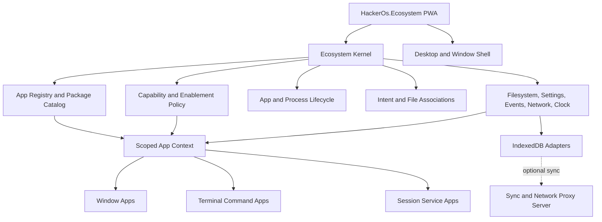
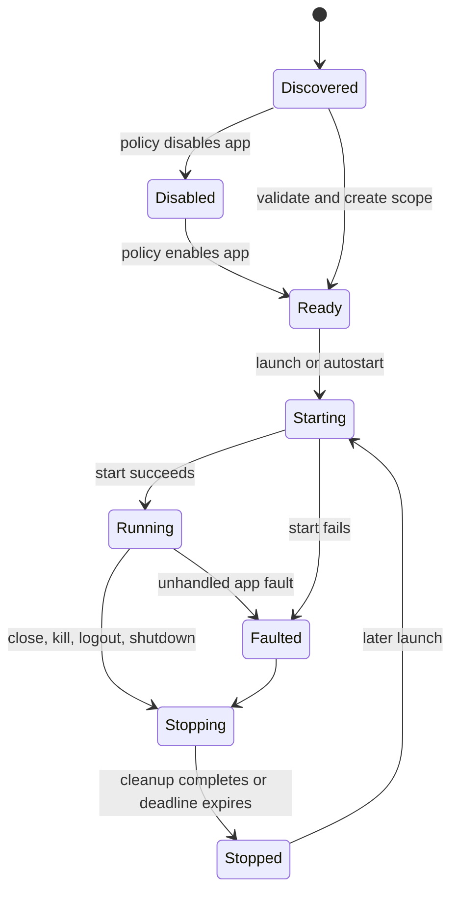

# HackerOS WebAssembly v3 Migration Analysis

**Status:** Approved for phased implementation  
**Date:** 2026-08-01  
**Scope:** Requirements, feasibility analysis, architecture, and delivery plan only. No implementation is defined by this document.

## 1. Purpose

HackerOS v3 will migrate the working TypeScript browser simulation in `src/` to
a modular Blazor WebAssembly ecosystem. The result must be both:

- a usable base operating system with first-party system applications; and
- a developer platform from which another developer can build a customized OS,
  select system features, and add applications without modifying the host.

The current TypeScript application is a behavioral reference. It proves many of
the desired interactions, but its classes and coupling are not the target
architecture. The earlier `wasm-ecosystem-usage.md` document contains useful
ideas, but it is not a source of truth for v3.

This document records the decisions made before implementation, identifies the
WebAssembly constraints that can invalidate those decisions, and defines gates
that must be passed before the migration expands.

## 2. Confirmed Decisions

| Topic | Decision |
| --- | --- |
| First milestone | Platform first. Prove the SDK, lifecycle, storage, shell, and a small number of reference apps before broad feature parity. |
| Shared architecture | The analysis may recommend several shared projects instead of one large shared project. |
| System apps | Optional first-party system apps use separate projects and the same lifecycle as external apps. Only boot-critical shell capabilities remain in the host. |
| Runtime app loading | Deliver in phases: build-time discovery first, then a feasibility-gated runtime package loader. |
| App trust | Apps declare capabilities. The user or administrator grants capabilities and the OS mediates access through capability-aware services. |
| Settings scopes | Support app/user, app/device, app/roaming-user, and protected OS-global scopes. |
| Data ownership | Browser IndexedDB is the local-first primary store. The optional server synchronizes records and proxies permitted network requests. |
| TypeScript migration | Treat `src/` as a behavioral reference. Do not run the old and new business logic together as a permanent architecture. |
| First vertical slice | Desktop, terminal, and files. |
| Terminal app | A terminal app is a command/executable hosted by a terminal session. The terminal emulator is a window app. |
| Background service shutdown | Service apps run only for the active OS session. OS shutdown requests cancellation. Volatile state is discarded and is not resumed. |
| OS customization | A developer build profile chooses shipped modules; runtime administrator/user policy controls which shipped modules are enabled. |
| File associations | Store associations in the settings system, expose them as editable virtual filesystem documents, and require administrator authority to modify them. Support defaults, an **Open With** chooser, and explicit app selection. |
| Authority hierarchy | Enforce `System > Administrator > User`. System apps have the highest OS authority, administrators may change protected OS settings, and normal users may change only user-authorized settings. |
| Compatibility | Manifests declare a semantic App SDK compatibility range and package dependencies. |
| Server proxy | Require app permission and authentication. Server configuration controls destinations, ports, quotas, and audit logging, including explicit options to allow all hosts or disable quotas/logging. Secure defaults remain restrictive. |

## 3. Goals

### 3.1 Product goals

1. Ship a functional offline-first HackerOS base with a desktop, windows,
   taskbar, launcher, terminal, virtual files, settings, and application
   lifecycle.
2. Make every non-boot-critical app replaceable and independently versioned.
3. Let developers create window, terminal, and service apps through stable base
   classes and narrow ecosystem interfaces.
4. Let an OS builder include or exclude first-party apps without editing OS
   internals.
5. Let an administrator disable shipped features, subject to declared
   dependencies and boot-safety rules.
6. Preserve the useful behavior of the TypeScript implementation while removing
   its central service-locator and hard-coded app-switch architecture.
7. Operate as a published PWA without a server after the first online install.
8. Optionally synchronize local records and proxy approved HTTP/TCP/UDP requests
   through a server.
9. Keep application packages and saved data compatible across controlled OS and
   SDK upgrades.

### 3.2 Engineering goals

- C# owns domain behavior and application contracts.
- JavaScript is limited to browser APIs or libraries that are impractical to
  replace, such as IndexedDB adapters, terminal rendering, and low-level pointer
  integration when required.
- Browser-specific implementations remain behind interfaces.
- Every Blazor component uses collocated scoped assets. CSS and JavaScript are
  never embedded in Razor markup.
- App code receives an app-scoped context, not the root dependency injection
  container and not a global `OS` object.
- Release builds, trimming, PWA caching, and browser reload behavior are tested
  from the first vertical slice.
- All public SDK contracts are versioned and documented before broad app ports.

## 4. Explicit Non-goals for the First Milestone

- Porting every app and command in `src/`.
- Runtime installation of arbitrary unreviewed DLLs.
- A cryptographically secure in-browser sandbox for third-party managed code.
- True background execution after the browser terminates the page.
- Multi-device real-time collaboration.
- Full Linux/POSIX compatibility.
- AOT compilation before the plugin model is proven compatible with it.
- Making the optional server the authoritative OS database.
- Preserving TypeScript class shapes merely to make the port mechanical.

## 5. Lessons from the Current TypeScript Application

The current implementation contains valuable domain behavior, but several
ownership boundaries are merged.

| Current area | Behavior to retain | Architecture to replace |
| --- | --- | --- |
| `core/os.ts` | Ordered startup, readiness, common OS services | One object constructs and exposes nearly every subsystem. Use host composition and narrow app context services instead. |
| `core/app-manager.ts` | App metadata, singleton activation, launch arguments, instance/process/window linkage | Hard-coded default registration and `switch`-based UI loading. Use manifests, descriptors, factories, and lifecycle handlers. |
| `core/window.ts` | Move, resize, focus, minimize, maximize, restore, close, z-order | Direct DOM ownership mixed with state. Keep authoritative window state in C# and isolate browser pointer interop. |
| `core/filesystem.ts` | Linux-like paths, aliases, metadata, text/binary files, async CRUD, IndexedDB persistence | Domain and IndexedDB access are combined. Separate filesystem semantics from record storage. |
| `commands/` | Command registry, arguments, working directory, streams, exit codes, aliases | Commands can depend on the live terminal renderer and global OS. Use command I/O and app-scoped capability interfaces. |
| `core/process.ts` | PID, app/process relation, resource simulation, termination | Random timer behavior is hard to test. Use a deterministic simulation clock and injectable random source. |
| settings classes | User overrides and machine defaults | Filesystem locations are used as the entire settings contract. Expose typed scopes and allow the storage layout to evolve. |
| network/websites | Simulated DNS, hosts, ports, HTTP-like requests, fake websites | Registration and request handling are attached to the global OS. Move them behind simulated network contracts. |
| app classes | User-visible workflows and interaction details | DOM construction and business behavior are often inseparable. Port behavior, then rebuild UI as Blazor components. |

### 5.1 Main failure pattern to avoid

The v3 migration fails if it begins by porting screens while the app contract,
storage boundary, lifecycle, and release behavior are still changing. That
creates many apps tied to temporary APIs and makes each architectural correction
an ecosystem-wide rewrite.

The first milestone therefore proves one complete path through every critical
boundary before additional apps are ported.

## 6. Recommended Solution Architecture

### 6.1 Why more than one shared project is recommended

A single `SharedProject` would force terminal commands and background services
to reference Blazor window types, browser infrastructure, and UI dependencies.
It would also make the public SDK difficult to distinguish from internal OS
implementation details.

Use multiple shared projects with one-way dependencies:

```text
wasm2/HackerOs/
  HackerOs.sln
  OS/
    HackerOs.Ecosystem/                 # Runnable Blazor WASM PWA host
  Shared/
    HackerOs.App.Abstractions/           # Stable manifests, contracts, DTOs
    HackerOs.AppSdk/                     # Lifecycle plus terminal/service bases
    HackerOs.AppSdk.Blazor/              # Window base and shared app UI contracts
    HackerOs.Simulation.Abstractions/     # Files, processes, network, clock contracts
  Platform/
    HackerOs.Platform.Core/              # Registry, lifecycle, policies, associations
    HackerOs.Platform.Blazor/            # Desktop, window shell, taskbar, launcher
    HackerOs.Infrastructure.Browser/     # IndexedDB, PWA, browser interop adapters
  Apps/
    System/
      HackerOs.Apps.Terminal/
      HackerOs.Apps.FileExplorer/
      HackerOs.Apps.Settings/
      HackerOs.Apps.SystemMonitor/
      ...one project per independently versioned app...
    Commands/
      HackerOs.Commands.Ls/
      HackerOs.Commands.Cd/
      ...one project per independently versioned command app...
    Samples/
      HackerOs.Samples.WindowApp/
      HackerOs.Samples.TerminalApp/
      HackerOs.Samples.ServiceApp/
  Server/
    HackerOs.Server/                     # Optional sync and network proxy
    HackerOs.Server.Contracts/           # Versioned transport records
  Tests/
    HackerOs.AppSdk.Tests/
    HackerOs.Platform.Tests/
    HackerOs.Infrastructure.Tests/
    HackerOs.E2E.Tests/
```

Names may change during scaffolding. The dependency rules are the important
part.

### 6.2 Dependency rules

1. App projects reference only the SDK/abstraction projects they require.
2. App projects never reference `HackerOs.Ecosystem`, browser infrastructure,
   another app implementation, or the root service provider.
3. Cross-app integration uses app IDs, intents, files, commands, or shared
   contracts. It does not call another app's concrete class.
4. The host references platform implementations and the build-profile-selected
   app projects.
5. Browser infrastructure implements shared interfaces but shared contracts do
   not reference browser infrastructure.
6. Server contracts contain transport data only. The browser remains able to
   build and run without the server project.
7. One project represents one independently installable and versioned app. A
   future command-pack format requires a separate architecture decision rather
   than becoming an accidental exception.

### 6.3 Runtime relationship



The ecosystem kernel coordinates services. It must not become a public object
that gives apps unrestricted access to every implementation.

## 7. Application Model

### 7.1 Canonical app identity

Every app has a stable, globally unique app ID, preferably reverse-domain style,
for example `org.hackeros.terminal`. The app ID is immutable after release and is
used for:

- registry identity;
- storage isolation;
- permission grants;
- process ownership;
- file associations;
- launch intents;
- dependency declarations;
- sync partitioning; and
- upgrade/migration history.

Changing a display name, icon, assembly name, namespace, or project name must not
change the app ID.

### 7.2 Manifest requirements

The manifest is a required, machine-readable file and is the canonical metadata
source. Build tooling may generate assembly metadata from it, but developers must
not maintain two independent copies.

| Manifest area | Required information |
| --- | --- |
| Identity | App ID, display name, package version, publisher ID, description |
| Compatibility | Minimum and maximum App SDK versions, optional OS constraints |
| Entry point | Assembly, app type, entry-point type, app kind |
| Presentation | Icon assets, category, localized labels, launch visibility |
| Lifecycle | Singleton/multi-instance policy, auto-start policy for services |
| Resources | Estimated or simulated CPU, memory, and storage characteristics |
| Capabilities | Requested filesystem, settings, launch, network, clipboard, notification, background, and OS capabilities |
| Settings schema | Keys, types, defaults, scope, validation, sensitivity, migration version |
| Intents | Supported launch intents and accepted argument contracts |
| File handling | MIME types/extensions, open/edit/create actions, priority hints; window apps only |
| Terminal | Command name, aliases, usage/help, input/output behavior; terminal apps only |
| Dependencies | Required and optional package IDs with semantic version ranges |
| Assets | Static CSS, JavaScript modules, images, localization files, integrity hashes |
| Update | Data migration identifiers and package upgrade rules |

Manifest validation is a build failure for first-party apps and an installation
failure for runtime packages.

Every first-slice app supplies the complete manifest, including every field that
applies to its app kind. Optional collections may be empty, but metadata is not
postponed to the mass-migration phase. This validates the intended SDK contract
before other apps depend on it.

### 7.3 Shared app contract

All three app types share a minimal lifecycle contract:

- immutable descriptor and identity;
- initialization with an app-scoped context;
- start with a typed launch request and cancellation token;
- stop request with a reason and cancellation deadline;
- deterministic disposal of in-memory resources;
- fault reporting through the OS logger;
- no assumption that stop/dispose runs after an abrupt browser or process exit.

The lifecycle state machine is owned by the ecosystem:



### 7.4 `WindowAppBase`

`WindowAppBase` is a Blazor component base class for applications that own one or
more visible windows.

It must provide:

- manifest-derived title, icon, and instance identity;
- launch arguments and typed intents;
- access to window commands without direct window-manager implementation access;
- initial/minimum/maximum dimensions and resize policy;
- close confirmation and cancellation hooks;
- focus, blur, minimize, maximize, restore, and resize notifications;
- process lifecycle linkage;
- file-open context for registered associations;
- standard `FileOpen`, `FileSave`, and `FolderSelect` dialog helpers;
- enforced collocated scoped CSS and JavaScript module conventions; and
- safe browser interop initialization that cannot be skipped by forgetting a
  base lifecycle call.

The last requirement addresses a known earlier failure where a derived component
overrode `OnAfterRenderAsync` without calling the base implementation, silently
preventing drag/resize interop from loading. Prefer composition or a sealed
framework lifecycle method that invokes overridable app hooks.

### 7.5 Mandatory scoped component assets

Every Blazor UI component keeps its markup, styles, and JavaScript module in
collocated files:

```text
MyApp.razor
MyApp.razor.css
MyApp.razor.js
```

This is a mandatory App SDK and first-party OS rule, not a style preference.

- Component CSS belongs in `ComponentName.razor.css` so Blazor CSS isolation
  scopes it to that component.
- Component-specific JavaScript belongs in `ComponentName.razor.js` and is
  imported as a module through the framework's interop lifecycle.
- Razor files must never contain `<style>` or `<script>` elements.
- Razor elements and components must never contain a `style` attribute.
- Razor markup must never contain inline JavaScript event attributes such as
  `onclick="..."`. Blazor event bindings may call C# methods, which may then use
  an injected interop abstraction when JavaScript is required.
- Shared CSS or JavaScript used by multiple components belongs in a dedicated
  static asset file owned by the appropriate SDK, platform, or app project. It
  is still never embedded in Razor markup.
- JavaScript modules must not mutate Blazor-owned DOM. A third-party browser
  library may own only its explicitly isolated host element.

Build validation must scan all `.razor` files and fail on inline CSS or
JavaScript. Project templates and review checklists must generate and expect the
collocated file pattern. A component that requires no CSS or JavaScript may omit
the corresponding empty asset file; any asset it does define must follow this
rule.

### 7.6 `TerminalAppBase`

`TerminalAppBase` represents a command/executable, not a terminal window. It runs
inside a shell session and must provide:

- command name, aliases, help, usage, and version from the manifest;
- parsed arguments while retaining access to original arguments;
- standard input, output, and error streams independent of the renderer;
- working directory, environment, current user, and cancellation token;
- integer exit status and structured failure information;
- access only to granted ecosystem capabilities; and
- no dependency on xterm.js or a concrete terminal component.

The terminal emulator is a separate `WindowAppBase`. It owns rendering, line
editing, history, completion, shell parsing, pipelines, and redirection. Command
apps own command behavior only.

### 7.7 `ServiceAppBase`

`ServiceAppBase` represents work with no primary window. A service may expose
status or settings through a separate intent/window, but its main lifecycle is
session-based.

Required semantics:

- explicit manual, on-login, or OS-start activation policy;
- only one instance unless the manifest explicitly permits otherwise;
- a long-running execution method controlled by an OS cancellation token;
- health, status, and fault events;
- bounded shutdown time;
- no automatic resume or reconstruction of volatile work;
- no guarantee of execution after the PWA/tab closes; and
- no correctness dependency on asynchronous unload cleanup.

When the user shuts down HackerOS, the OS cancels all service tokens and waits up
to a configured deadline. In-memory state is discarded. Data already committed
through settings or filesystem services remains persistent, but there is no job
checkpoint/resume contract. Abrupt browser termination may prevent graceful
cancellation, so services must not require a final write for correctness.

True always-running work belongs on the optional server and is not a browser
service app.

### 7.8 App-scoped ecosystem context

Apps need broad functionality, but one giant `IOS` interface would recreate the
current coupling. The app context should expose small capability-aware gateways:

- app identity and current user session;
- app settings and declared settings schema;
- virtual filesystem with app/user-aware authorization;
- app launch and intent dispatch;
- file open/default-app selection;
- process/job registration and simulated resource usage;
- command streams and shell environment;
- notifications and dialogs;
- clipboard and drag/drop payloads;
- localization, theme tokens, and accessibility preferences;
- logging, diagnostics, clock, timers, and deterministic simulation time;
- simulated network services;
- optional external network proxy;
- event publication/subscription with typed contracts; and
- permission status and grant requests.

Only gateways declared by the app and granted by policy are functional. The app
must not receive raw IndexedDB, unrestricted `IJSRuntime`, root DI, or server
credentials by default.

## 8. Application Discovery, Packaging, and Installation

### 8.1 Discovery stage A: referenced assemblies

The first release discovers apps from an explicit set of assemblies selected by
the OS build profile. Within those assemblies, the registry scans for validated
app entry points and matches each one to its manifest.

Requirements:

1. The build profile decides which app project references are published.
2. Startup supplies the known assembly set to the registry; do not assume every
   assembly is already loaded or that unrestricted `AppDomain` scanning behaves
   like desktop .NET.
3. Duplicate app IDs, commands, incompatible SDK ranges, missing dependencies,
   and invalid manifests fail predictably.
4. Discovery order never determines conflict winners.
5. Release/trimming tests prove all discoverable entry points remain available.
6. Disabled apps can remain shipped but are not activated, registered as file
   defaults, or auto-started.

### 8.2 Discovery stage B: build-known lazy assemblies

Blazor WebAssembly officially supports lazy loading assemblies declared to the
build, including explicit declaration of their dependencies. This phase reduces
initial download size and proves delayed registration while preserving a known
publish graph.

This is not yet runtime installation from HackerOS storage. The assembly and its
assets are still known when the PWA is published.

The build profile marks app packages as eager or lazy, and build tooling
translates that choice into the required project/publish declarations. Core
shared SDK assemblies load eagerly once. Every lazy app declaration includes its
app-specific managed dependencies and static assets; dependency discovery is not
deferred to a runtime failure.

### 8.3 Discovery stage C: installed runtime packages

Loading a package from the simulated OS filesystem is a research milestone with
an explicit go/no-go gate. A proof of concept must demonstrate all of the
following in a **published Release PWA**, online and offline:

- read package bytes from browser storage;
- verify package structure, hashes, publisher policy, manifest, and SDK range;
- resolve managed dependencies without colliding with host assemblies;
- load and discover a Razor window app, terminal app, and service app;
- load scoped CSS, JavaScript modules, icons, and localization assets;
- render a dynamically loaded Razor component;
- unload/disable behavior, acknowledging that managed assemblies may not be
  unloadable without restarting the PWA;
- survive page reload and reconstruct the installed catalog;
- coexist with trimming and the chosen interpreter/AOT settings;
- work with service-worker caching and atomic PWA updates; and
- reject malformed, incompatible, or partially installed packages atomically.

Until that gate passes, v3 promises install-like catalog management only for
build-known packages. The UI must not claim that arbitrary DLL installation is
supported.

### 8.4 Package transaction

An install or upgrade is atomic:

1. Acquire package into a staging area.
2. Validate manifest, SDK range, dependencies, assets, hashes, and policy.
3. Present requested capabilities and obtain grants.
4. Run versioned data/schema migrations against a transaction or recoverable
   snapshot.
5. Commit package catalog and files together.
6. Activate immediately only if the runtime supports it safely; otherwise mark
   activation for the next PWA restart.
7. Roll back the staged package and migrations if any required step fails.

Uninstall removes package code and grants, but user data retention is an explicit
choice. It must never silently delete app data.

## 9. Trust and Capability Security

### 9.1 Important limitation

All loaded managed assemblies execute in the same browser/.NET process. A
capability API is a strong architecture and policy boundary for cooperative or
reviewed apps, but it is not a guaranteed security sandbox for malicious managed
code. Client-side code can also be inspected and modified by the local user.

Therefore:

- v3 initially treats executable app packages as trusted or reviewed code;
- package signatures identify publishers and integrity, not behavioral safety;
- sensitive server authorization is always enforced by the server;
- secrets are never embedded in the PWA or app assemblies;
- untrusted third-party code requires a later isolation design, such as a
  restricted interpreter, dedicated Web Worker protocol, or sandboxed iframe;
  and
- the permission UI must not promise isolation the platform cannot enforce.

### 9.2 Capability groups

At minimum, define capabilities for:

- private app files;
- user-selected files;
- broad user-home read/write;
- protected/system filesystem operations;
- app/user, app/device, roaming, and OS-global settings;
- show file-open, file-save, and folder-selection dialogs;
- launch another app;
- register file handlers or defaults;
- clipboard read/write;
- notifications;
- service auto-start;
- simulated network access;
- external HTTP proxy;
- external TCP/UDP proxy with destinations and ports;
- user/session information; and
- administrative OS operations.

Permissions are denied by default, versioned with the manifest, revocable, and
auditable. An app update that expands permissions requires a new grant. Disabling
an app revokes active handles and cancels its processes/services.

## 10. Settings and Storage

### 10.1 Authority hierarchy

Settings and filesystem writes use one explicit authority hierarchy:

```text
System > Administrator > User
```

- **System** is assigned to the ecosystem kernel and enabled system apps. It may
  maintain protected OS settings and perform system migrations. System apps
  still use declared capabilities and audited APIs; the role is not permission
  to bypass the settings service or write raw IndexedDB records.
- **Administrator** may edit protected OS/admin settings, app enablement,
  permission policy, and file associations through authorized settings or
  filesystem operations.
- **User** may read effective OS settings and edit only settings explicitly
  declared writable by that user, such as their app preferences. A normal user
  cannot change file associations or other OS/admin policy.

Higher authority may perform operations allowed to lower authority unless a
setting has a more restrictive explicit policy. Every protected write records
the acting principal, authority, source app, timestamp, and affected setting.
Merely being a first-party window or command app does not grant System authority;
the signed build profile/installed package policy identifies trusted system apps.

Authorization evaluates both the app capability and the acting user authority.
A system app does not lend its System authority to the normal user operating its
UI. For example, a user editing `/etc/hackeros/file-associations.json` in the
system Text Editor still requires Administrator elevation. System authority is
used only for explicit OS-owned operations running in a separate, audited system
execution context. This prevents a trusted system UI from becoming an ambient
privilege-escalation path.

### 10.2 Required settings scopes

| Scope | Key partition | Intended use | Sync behavior |
| --- | --- | --- | --- |
| App + user | app ID + user ID | Default private preferences | Local unless declared roaming |
| App + device | app ID + installation ID | Device-specific UI/performance choices | Never roam by default |
| App + roaming user | app ID + user ID | Preferences shared across devices | Eligible for server sync |
| OS global/admin | OS namespace + installation | Protected system policy | Admin-only; server policy may override |

Each declared setting includes a stable key, data type, default, validation,
scope, sensitivity classification, and schema version. Apps cannot choose a
broader scope at runtime than the manifest declaration.

### 10.3 Filesystem-accessible settings

Settings are canonical typed documents managed by the settings service and are
also exposed through the virtual filesystem, following the Linux principle that
system configuration can be inspected and edited as files. The filesystem view
is an adapter over the same settings records, not a copied or independently
persisted representation.

Recommended virtual paths are:

```text
/etc/hackeros/                         # Protected OS/admin settings
/etc/hackeros/file-associations.json   # Canonical file-association policy
/etc/hackeros/apps/                    # Protected system app policy/defaults
/home/{user}/.config/hackeros/         # User-writable OS preferences
/home/{user}/.config/apps/{appId}/     # App/user settings
```

Requirements:

1. Reading a settings path serializes the current canonical document in a
  documented, deterministic, human-editable format such as JSON.
2. Writing through a text editor or terminal command invokes the settings
  service with the caller identity; it never bypasses authorization.
3. The settings service parses and schema-validates the entire candidate
  document before committing it atomically.
4. Invalid syntax, unknown protected keys, invalid values, or insufficient
  authority reject the write and preserve the previous document.
5. A successful write publishes a settings-changed event so associations,
  policies, and running apps can reload without polling.
6. Concurrent edits use a revision/precondition check and report a conflict
  instead of silently overwriting a newer version.
7. Sensitive values may be redacted or represented by protected references;
  making settings file-accessible does not require exposing secrets as text.

File associations and all OS/admin documents under `/etc/hackeros/` require
Administrator or System authority to modify. Users and apps with read permission
may inspect them with a text editor. User-editable preferences remain under the
current user's `.config` tree.

### 10.4 Browser persistence

IndexedDB stores structured records behind repository interfaces. Do not model
the entire database as one serialized object or expose IndexedDB keys as public
SDK contracts.

Logical stores should separate at least:

- users and sessions;
- app catalog and package metadata;
- permission grants;
- canonical settings records and their virtual-filesystem projections;
- virtual filesystem metadata and content/blob records;
- derived file-association lookup indexes rebuilt from canonical settings;
- OS policy/build-profile state;
- sync metadata and tombstones; and
- diagnostics with bounded retention.

Database migrations are versioned, idempotent where practical, recoverable, and
tested against data from every supported release.

### 10.5 Local-first sync

The server synchronizes records, not a raw browser database file. The browser can
read and write while offline; synchronization resumes when authenticated and
online.

Every syncable record needs a stable record ID, scope/owner, schema version,
revision, modified timestamp, originating device ID, and deletion tombstone.
Conflict behavior is domain-specific and must be decided before the sync phase:

- settings may use deterministic last-writer rules with conflict history;
- files require revision/conflict copies or an explicit merge strategy;
- permissions and OS policy must not be weakened by client conflict resolution;
  and
- app packages should synchronize by immutable package hash, not mutable blobs.

No first-milestone feature may depend on the server being reachable.

## 11. File Open and App Launch Model

### 11.1 Typed intents

Apps interact through typed intents rather than concrete references. Initial
intents should include:

- launch app;
- open file;
- edit file;
- reveal file in folder;
- open URI in simulated browser;
- execute terminal command; and
- show app settings or status.

Every intent carries the caller app ID, target or resolver request, arguments,
user/session identity, cancellation, and optional result contract.

The core open-file intent carries a virtual path or authorized file handle, the
requested action (`open`, `edit`, or `reveal`), detected media type, and an
optional preferred app ID. The first slice implements only the listed core
intents. Later app-defined intents use registered, namespaced IDs and versioned
payload schemas; they must not introduce concrete project references between
apps.

### 11.2 File associations

Only window apps may declare file handlers. The resolver:

1. honors an explicit target app if enabled and compatible;
2. otherwise uses the effective configured default for the action/type;
3. otherwise selects the only compatible enabled handler;
4. otherwise presents **Open With**; and
5. reports a recoverable no-handler result when none exists.

Associations should use MIME/media type when known and normalized extensions as
a fallback. Manifests declare available handlers, while the canonical association
and default policy is stored in the settings system and exposed at
`/etc/hackeros/file-associations.json`. Installing an app cannot silently replace
an existing default. Changing the policy requires Administrator or System
authority. Disabling or uninstalling an app invalidates its configured defaults
and the resolver falls back to another enabled handler or **Open With**.

### 11.3 Standard file and folder dialogs

`WindowAppBase` provides asynchronous helpers for three ecosystem-owned dialogs:

- **FileOpen:** choose one or multiple existing files, with extension/media-type
  filters, initial folder, and optional read/write access request.
- **FileSave:** choose a destination and filename, apply a default extension,
  validate names, and confirm replacement of an existing file.
- **FolderSelect:** choose an existing folder and optionally allow creating a new
  folder when policy permits it.

The App SDK should expose consistently named operations such as
`OpenFileAsync`, `SaveFileAsync`, and `SelectFolderAsync`, each accepting a typed
request and cancellation token and returning a typed selected/cancelled result.

The helpers return virtual filesystem paths or short-lived authorized handles,
never browser DOM elements or raw IndexedDB keys. They honor the current user,
app capabilities, filesystem permissions, cancellation, and the dialog owner's
window modality. Cancellation returns a normal cancelled result rather than an
exception. The dialog implementation is shared OS UI with scoped assets; apps do
not reimplement file pickers.

These dialogs select from the HackerOS virtual filesystem. Access to native
browser/device files is a separate future capability and must not be implied by
these helpers.

## 12. PWA and Browser Constraints

### 12.1 Offline model

The published PWA caches the OS shell and build-known assets. Offline support is
validated against published output, because development builds do not represent
service-worker behavior.

The design must account for users running an older cached application version
for at least one additional visit while an update waits to activate. This means:

- storage schemas support the documented compatibility window;
- server APIs are backward compatible for supported PWA versions;
- app manifests declare SDK ranges;
- an update never mixes assets from different releases; and
- installed package activation is coordinated with the active OS/SDK version.

### 12.2 Browser platform limits

- WebAssembly code has browser capabilities, not native OS capabilities.
- Browser clients cannot directly open arbitrary TCP or UDP sockets. Those
  operations require the optional server proxy.
- IndexedDB quota and eviction vary by browser. The OS needs quota reporting,
  low-space behavior, export/backup, and recoverable write errors.
- Abrupt tab closure does not guarantee asynchronous cleanup.
- Timer execution is throttled in background tabs.
- Mobile browsers have tighter memory limits, affecting assembly count, editors,
  and large virtual files.
- Direct JavaScript mutation of Blazor-owned DOM can desynchronize rendering.
  Browser libraries must own isolated elements with explicit lifecycle wrappers.

## 13. Optional Server Architecture

The server is optional and additive. It has two responsibilities only:

1. synchronize an authorized copy of selected local records; and
2. proxy network operations that browsers cannot or should not perform directly.

It must not contain required desktop, app, command, filesystem, or simulation
logic.

### 13.1 Sync service requirements

- authenticated user/device identity;
- record-level push/pull with revisions and tombstones;
- bounded batches, resumable transfers, and content hashes;
- explicit conflict responses;
- per-user/app authorization;
- encryption in transit and appropriate encryption at rest;
- server API versioning compatible with the supported PWA window; and
- export and deletion controls.

### 13.2 Network proxy requirements

The proxy accepts normalized requests, performs server-side authorization, and
returns bounded structured responses. It must defend the server even if the PWA
or app permission checks are bypassed.

Default policy:

- authenticated requests only;
- deny destinations and ports unless allowed;
- block loopback, link-local, cloud metadata, and private infrastructure unless
  explicitly configured;
- enforce protocol, DNS, redirect, payload, duration, and concurrency limits;
- apply quotas and audit logging; and
- associate every request with user, device, and caller app ID.

Server `appsettings` may deliberately allow all hosts, broaden ports, disable
quotas, or disable audit logging. These are explicit operator choices with
startup warnings; they are not default behavior.

When offline or when the server edition is not configured, external proxy calls
return a clear unavailable result. Simulated HackerOS networking continues to
work locally.

## 14. Build Profile and Runtime Policy

### 14.1 Developer build profile

The build profile is source-controlled configuration used before publish. It
selects:

- included app projects/packages;
- boot-critical shell implementation;
- default enabled apps;
- required capabilities and policies;
- default file associations;
- optional server features;
- themes/locales/assets; and
- whether experimental runtime package loading is present.

The build validates the complete dependency graph. Excluding an app excludes its
assemblies and static assets from the PWA.

### 14.2 Runtime policy

Runtime settings may enable or disable shipped optional apps by installation or
user policy, but changing that policy requires Administrator or System
authority. They cannot disable boot-critical recovery capabilities unless an
alternative is configured.

The policy engine must explain why an app cannot be disabled, for example a
required dependency, active process, or only available handler for a mandatory
OS operation. Dependency graphs must be acyclic; builds and installations reject
cycles. Forced disable cancels running instances in reverse topological order so
dependents stop before their dependencies.

Boot-critical functions should be very small: startup, login/session, package
catalog recovery, policy recovery, basic shell rendering, and diagnostics. The
terminal, file explorer, settings UI, monitor, browser, and editors remain apps.

## 15. First Vertical Slice: Desktop + Terminal + Files

The first slice is complete only when it exercises the real contracts intended
for later apps.

### 15.1 Included projects/capabilities

- PWA host and desktop shell;
- window manager, taskbar, and launcher;
- app registry and build-profile discovery;
- complete manifests for every included app, with all app-kind-applicable fields;
- capability policy with visible grants;
- process lifecycle and deterministic resource model;
- IndexedDB-backed virtual filesystem plus in-memory test storage;
- terminal emulator as a window app;
- `pwd`, `ls`, `cd`, `cat`, and `echo` as terminal apps;
- file explorer as a window app;
- text viewer/editor as the first file handler;
- app/user and app/device settings;
- file association resolver and **Open With**;
- filesystem-backed settings documents and authority enforcement;
- shared `FileOpen`, `FileSave`, and `FolderSelect` dialogs;
- one cancellable sample service app; and
- published PWA offline/reload tests.

### 15.2 Acceptance criteria

1. A clean profile initializes a Linux-like root and current-user home exactly
   once.
2. Reloading the browser retains committed files, settings, grants, defaults,
   and installed catalog state.
3. Desktop/launcher actions open Terminal and File Explorer through the intent
   service, not concrete references.
4. Window move, resize, focus, minimize, maximize, restore, taskbar activation,
   and close work by mouse, touch/pointer, and keyboard where applicable.
5. Launching a singleton app focuses/restores its existing instance without
   creating a second process.
6. Every app launch creates a process record; close/kill removes the instance and
   cancels its token.
7. Terminal commands run through `TerminalAppBase`, use renderer-independent
   streams, honor working directory/cancellation, and return correct exit codes.
8. Files created or edited in one app are immediately visible in the other apps
   and remain after reload.
9. Opening a supported file uses the effective configured default; multiple
   handlers show **Open With**; explicit app selection is honored.
10. An app denied broad filesystem permission cannot obtain a broad filesystem
    handle through the normal SDK.
11. A normal user can read but cannot modify
  `/etc/hackeros/file-associations.json`; an Administrator or System app can
  edit it through a text editor, and valid changes update resolution without a
  reload while invalid changes are rejected atomically.
12. File-open, file-save, and folder-selection helpers enforce filters,
  permissions, overwrite confirmation, modality, and cancellation.
13. Disabling an optional app removes it from launchers/associations and cancels
    active instances without corrupting its retained data.
14. OS shutdown cancels the sample service; a later startup creates a fresh
    service with no resumed volatile state.
15. The slice works after a published online install with the server stopped and
    the browser placed offline.
16. A PWA update preserves compatible data and does not mix old/new static
    assets.
17. All unit and command/repository contract tests run without xterm.js,
  IndexedDB, or a browser by substituting command streams and in-memory
  repositories. Browser, static-asset, and PWA lifecycle behavior runs in CI
  browser automation.

### 15.3 Exit gate

Do not begin mass app conversion until all acceptance criteria pass in CI and a
published browser test. This gate is the primary protection against a fourth
migration attempt accumulating apps on unstable foundations.

## 16. Migration Map from `src/`

| Migration wave | TypeScript source | v3 treatment |
| --- | --- | --- |
| 0 - behavioral capture | all current app workflows | Record smoke tests/screenshots and domain examples before replacing behavior. Do not require line-for-line equivalence. |
| 1 - platform slice | `os.ts`, `app-manager.ts`, `window.ts`, `desktop.ts`, `start-menu.ts`, `filesystem.ts`, terminal and basic file commands | Rebuild around v3 contracts; preserve proven behavior listed in the first-slice criteria. |
| 2 - OS fundamentals | settings, process monitor, dialogs, notifications, error logging, user/session behavior, themes | Port domain semantics; create separate first-party app projects for visible tools. |
| 3 - editing workflow | text editor, code editor, file type registry, clipboard/drag-drop | Keep browser editor libraries behind isolated interop components when replacing them is impractical. |
| 4 - simulated network | network, browser, web client/server, websites, `curl`, `ping`, `nmap` | Port the simulated network domain independently from the real server proxy. Never let gameplay requests accidentally reach real targets. |
| 5 - remaining utilities | calculator, paint, error viewer, theme tools, advanced commands | Port app by app after SDK stability and compare against captured behavior. |
| 6 - gameplay systems | missions, economy, upgrades, security simulation, scripts | Build on stable files/process/network services; define separate domain plans before implementation. |
| 7 - optional server | sync and external proxy | Add only after offline behavior and local schema are stable. |
| 8 - runtime install research | package loader | Run the release-PWA proof of concept and commit only if its gate passes. |

### 16.1 Reuse policy

Reuse means preserving tests, domain rules, sample data, command semantics,
visual assets, and user workflows. It does not mean translating each TypeScript
class into a C# class.

Before porting an area:

1. identify its observable behavior and data contract;
2. capture representative tests against the TypeScript app where practical;
3. identify DOM/library dependencies;
4. assign each behavior to SDK, platform, infrastructure, or app ownership;
5. implement the smallest vertical behavior in C#; and
6. remove the TypeScript behavior from the migration path after parity is
   accepted.

## 17. Delivery Phases and Gates

### Phase 0: architecture validation

- approve this analysis;
- settle deferred decisions needed for scaffolding;
- create architecture decision records for plugin loading, package trust,
  storage/sync, and app project boundaries;
- capture baseline TypeScript behavior; and
- prototype the highest-risk browser interop only.

**Gate:** dependency rules, lifecycle, manifest ownership, and first-slice tests
are accepted before solution scaffolding expands.

### Phase 1: contracts and headless kernel

- app abstractions and manifest validation;
- lifecycle, registry, capabilities, intents, process model;
- in-memory filesystem/settings repositories;
- terminal command streams and parser boundary; and
- unit/contract tests.

**Gate:** platform behavior runs without Blazor or a browser.

### Phase 2: browser platform and first slice

- Blazor PWA host and shell;
- window system;
- IndexedDB repositories;
- terminal, core command apps, files, first file handler, and sample service;
- build profiles and runtime enablement; and
- published offline end-to-end tests.

**Gate:** every first-slice acceptance criterion passes.

### Phase 3: SDK stabilization

- create three developer sample apps;
- publish SDK documentation and templates;
- compatibility tests against multiple app package versions;
- accessibility and localization baseline;
- package/manifest validation tooling; and
- freeze App SDK 1.0 surface.

**Gate:** a developer can build each app type without referencing host internals.

### Phase 4: systematic app migration

- port one migration wave at a time;
- add behavior tests before each port;
- maintain project-per-app isolation; and
- reject SDK changes motivated by one app unless they are general ecosystem
  capabilities.

**Gate:** each app has manifest, isolated settings/data, permission tests,
lifecycle tests, and behavioral acceptance tests.

### Phase 5: optional server

- sync contracts and conflict behavior;
- authenticated server storage;
- HTTP/TCP/UDP proxy with operator policy;
- offline/reconnect and backward-compatibility tests; and
- operational logging, quotas, and security tests.

**Gate:** disabling or losing the server never prevents local OS startup/use.

### Phase 6: runtime package feasibility

- select the interpreter/AOT/trimming test matrix, then execute the discovery
  stage C loader proof of concept from Section 8.3;
- define signing/review/isolation position; and
- either implement the package loader or document build-known packages as the
  supported model.

**Gate:** no runtime-install marketing or UI before the complete published-PWA
proof succeeds.

## 18. Testing Strategy

### 18.1 Required test layers

- **Contract tests:** every settings, filesystem, sync, and intent implementation
  satisfies the same behavior suite.
- **Unit tests:** manifests, registry conflicts, lifecycle transitions,
  authority hierarchy, capabilities, associations, settings document parsing,
  shell parsing, commands, and deterministic process simulation.
- **Component tests:** window app hooks, permission prompts, launcher/taskbar,
  dialog modality/cancellation, settings rendering, and file chooser behavior.
- **Integration tests:** app launch to process/window cleanup, storage migrations,
  filesystem-backed settings edits, protected-write rejection, association
  reload, package transactions, and cancellation.
- **Published PWA tests:** first install, offline restart, service-worker update,
  old-version compatibility, quota/write failures, and corrupted cache recovery.
- **End-to-end browser tests:** desktop, terminal/files workflow, pointer and
  keyboard windows, reload persistence, disabled apps, and user defaults.
- **Server security tests:** destination validation, SSRF protections,
  authorization, quotas, redirects, payload limits, and audit policy.

### 18.2 Release quality rules

- Test Release/trimming output, not Debug only.
- Fail the build when Razor markup contains inline CSS or JavaScript, including
  `<style>`, `<script>`, `style=`, or JavaScript event attributes.
- Require component-owned assets to use the collocated `.razor.css` and
  `.razor.js` naming convention.
- No app may rely on an unhandled base-component lifecycle override.
- No timer/random behavior is accepted without deterministic test control.
- No app gets the root service provider.
- No browser storage schema change ships without upgrade and rollback fixtures.
- No first-party app ships without a valid manifest and isolated project.
- No server endpoint trusts caller app ID, permission, or user claims solely
  because the client supplied them.

## 19. Major Risks and Mitigations

| Risk | Consequence | Mitigation/gate |
| --- | --- | --- |
| Runtime DLL loading is assumed to behave like desktop .NET | Installed apps fail after publish, trimming, offline use, or asset loading | Keep it phased and gated by a published Release PWA proof. |
| Shared project becomes a new global OS object | Every app couples to internals and SDK cannot evolve | Split abstractions/SDK/UI; provide app-scoped capability gateways. |
| Porting UI before contracts stabilize | Repeated rewrites across many apps | Enforce the first vertical-slice exit gate. |
| Permission model is presented as a sandbox | Users trust protections that same-process code can bypass | Treat executable packages as trusted/reviewed; describe permissions as policy; isolate untrusted code separately. |
| PWA versions and database versions diverge | Older cached clients corrupt or cannot open data | Compatibility window, versioned migrations, atomic service-worker assets, old-client tests. |
| Abrupt close is treated as graceful shutdown | Services lose final writes or leave required state incomplete | Cancellation is best-effort; require durable writes during operation and no resume/finalizer dependency. |
| Static assets from runtime apps are ignored | Dynamic Razor app loads without styles/scripts/icons | Package asset loader is part of the plugin proof, not a later polish task. |
| Server proxy becomes an open relay/SSRF path | Host network compromise or abuse | Restrictive defaults, server enforcement, destination normalization, quotas, authentication, and audits. |
| Sync is implemented as copying IndexedDB | Conflicts, corruption, and schema lock-in | Record-level versioned sync with tombstones and domain conflict rules. |
| Too many app projects become difficult to maintain | Slow builds and inconsistent package metadata | Central build properties, templates, manifest validation, solution filters, and project-generation tooling. |
| JavaScript mutates Blazor-owned DOM | Silent UI breakage and difficult debugging | Isolated library-owned elements and lifecycle-tested interop wrappers. |
| TypeScript behavior is forgotten during redesign | Functional regression despite cleaner architecture | Capture behavioral tests and migration acceptance criteria before each wave. |

## 20. Deferred Decisions

These do not block this analysis but must be decided before their related phase:

1. Exact target .NET LTS version and supported browser matrix.
2. Package archive format, publisher identity, signing, trust store, and revocation.
3. Whether runtime-loaded managed apps can ever be considered untrusted, and the
   isolation technology if they can.
4. Exact shell grammar for quotes, variables, pipes, redirection, jobs, and
   scripts.
5. File content chunking/deduplication and maximum supported virtual file size.
6. IndexedDB quota/export/restore user experience.
7. Per-domain sync conflict algorithms and supported offline history depth.
8. Authentication design for local-only users versus synchronized identities.
9. Which settings are sensitive and whether client-side encryption is required.
10. Whether package activation always requires a PWA restart after runtime
    installation.
11. SDK deprecation/support window and package upgrade policy.
12. Exact boot-critical recovery interface when Settings and Terminal apps are
    disabled.

Each decision should become a short architecture decision record rather than an
undocumented implementation choice.

## 21. Definition of Migration Success

The v3 migration is successful when:

- the OS runs offline as a published Blazor WebAssembly PWA;
- system apps and external apps use the same documented SDK boundaries;
- window, terminal, and service apps have distinct lifecycle-correct base types;
- each independently versioned app is isolated in its own project and manifest;
- developers can select shipped apps with a build profile and administrators can
  disable optional shipped apps safely;
- app settings and data are partitioned by app and user with declared scopes;
- apps can launch other apps and open files through typed intents;
- file associations support defaults and **Open With**;
- local files/settings survive reload and controlled upgrades;
- optional server loss never prevents local OS use;
- server sync and network proxy enforce server-side policy;
- broad TypeScript feature migration begins only after the first platform slice
  passes its Release-PWA gate; and
- runtime-installed assemblies are supported only if the complete feasibility
  gate proves them reliable.

## 22. Planning Checklist

- [x] Clarify product priority and first vertical slice.
- [x] Clarify app types, system app packaging, storage scopes, and shutdown model.
- [x] Clarify build/runtime customization and file association behavior.
- [x] Clarify local/server ownership and proxy policy.
- [x] Inventory the current TypeScript subsystem boundaries.
- [x] Identify Blazor WebAssembly, PWA, plugin, and client-security constraints.
- [x] Recommend project boundaries and dependency rules.
- [x] Define phased migration gates and acceptance criteria.
- [x] Review and approve this analysis.
- [ ] Resolve Phase 0 deferred decisions in architecture decision records.
- [x] Begin implementation only after Phase 0 approval.

## 23. Reference Material

- Existing ideas: `doc/wasm/wasm-ecosystem-usage.md`
- Working behavioral reference: `src/`
- Product background: `project requirement v2.md`
- Microsoft Learn: [Lazy load assemblies in ASP.NET Core Blazor WebAssembly](https://learn.microsoft.com/aspnet/core/blazor/webassembly-lazy-load-assemblies?view=aspnetcore-10.0)
- Microsoft Learn: [ASP.NET Core Blazor Progressive Web Application](https://learn.microsoft.com/aspnet/core/blazor/progressive-web-app/?view=aspnetcore-10.0)
- Microsoft Learn: [Secure ASP.NET Core Blazor WebAssembly](https://learn.microsoft.com/aspnet/core/blazor/security/webassembly/?view=aspnetcore-10.0)