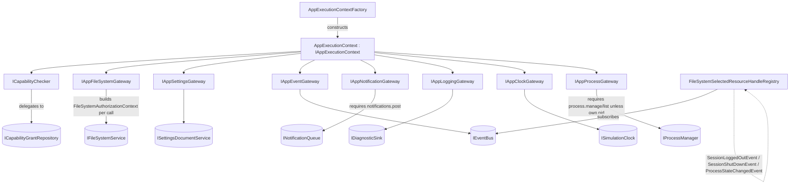

# App Execution Context and Scoped Gateways

**Task list section:** [`integration-task-list.md` § 7.1](integration-task-list.md)
(`P1-EXEC-001` through `P1-EXEC-008`).
**Status:** Complete for Phase 1 scope, with two intentional deferrals (network
gateway; app-disable/uninstall/policy-change handle revocation) documented
below and in the task list.

## Purpose

Every running app instance (Window, Terminal, or Service) is given exactly one
`IAppExecutionContext`. It is the *only* way app code touches the platform:
there is no root `IServiceProvider`, no raw `IJSRuntime`, no direct access to
`IFileSystemService`, `IProcessManager`, `ICapabilityGrantRepository`, or any
other Platform.Core singleton. Every capability an app might have is expressed
as one of seven narrow gateway interfaces, each of which enforces trusted OS
policy for that exact app/user/process before doing anything.

This mirrors how a real OS hands a process a small set of file descriptors and
system-call surface instead of raw kernel memory access — apps can only do what
their granted capabilities and authority allow, and every denial is a stable,
inspectable result rather than a thrown-away exception.

## Architecture



### Key classes

| Class | Location | Role |
|---|---|---|
| `IAppExecutionContext` | `Shared/HackerOs.AppSdk/IAppExecutionContext.cs` | App-facing contract; expanded in place (not moved to an `Execution/` subfolder). |
| `ICapabilityChecker` / `AppCapabilityChecker` | `Shared/HackerOs.Simulation.Abstractions/Gateways/AppGatewayContracts.cs` / `Platform/HackerOs.Platform.Core/Execution/` | Evaluates/requires one capability for the bound app/user/authority, without exposing the grant repository. |
| `IAppFileSystemGateway` / `AppFileSystemGateway` | same | Full FS CRUD surface; builds a fresh `FileSystemAuthorizationContext` per call; `WithSelectedHandle(...)` returns a scoped copy. |
| `IAppSettingsGateway` / `AppSettingsGateway` | same | Thin `ISettingsDocumentService` wrapper bound to the app's `AppOperationContext`. |
| `IAppEventGateway` / `AppEventGateway` | same | Thin `IEventBus` pass-through (`Subscribe<TEvent>`/`Publish<TEvent>`). |
| `IAppNotificationGateway` / `AppNotificationGateway` | same | Requires `notifications.post` before enqueuing. |
| `IAppLoggingGateway` / `AppLoggingGateway` | same | Wraps `IDiagnosticSink`, stamping every entry with the app ID and a fresh correlation ID. |
| `IAppClockGateway` / `AppClockGateway` | same | Read-only `ISimulationClock` wrapper (`UtcNow`, `CurrentTick`, `Schedule`, `DelayAsync`). |
| `IAppProcessGateway` / `AppProcessGateway` | same | Own process always observable/stoppable/killable; managing or listing *other* processes requires `process.manage`/`process.list`. |
| `IFileSystemSelectedResourceHandleRegistry` / `FileSystemSelectedResourceHandleRegistry` | `Shared/.../Gateways/FileSystemSelectedResourceHandleRegistryContracts.cs` / `Platform/.../Execution/` | Issues/tracks/revokes short-lived selected-resource handles (e.g. from a file-open dialog), auto-revoking on session logout, shutdown, or owning-process termination. |
| `AppExecutionContextFactory` | `Platform/HackerOs.Platform.Core/Execution/` | The **sole** trusted constructor for `IAppExecutionContext`. |
| `AppExecutionContext` | same | `internal sealed class`; unreachable from app code — only the factory can construct one. |

## Usage

Only platform-hosting code (not apps) calls the factory, typically right after
a process is started for a validated manifest and authenticated principal:

```csharp
IAppExecutionContext context = executionContextFactory.Create(
    manifest,            // validated AppManifest
    principal,           // AuthenticatedPrincipal that owns the hosting session
    process,             // ProcessRecord already returned by IProcessManager.Start
    grantedCapabilities); // capabilities trusted policy actually granted, evaluated
                          // against ICapabilityGrantRepository ahead of time
```

App code then only ever sees the narrow interface:

```csharp
// Denied operations throw a stable, inspectable exception:
try
{
    context.Notifications.Post(NotificationSeverity.Information, "Done", "Export finished.");
}
catch (AppGatewayAccessDeniedException ex)
{
    // ex.Capability == "notifications.post"; ex.Evaluation.Reason == CapabilityPolicyEvaluationReason.Missing
}

// An app may always stop or kill its own process without any capability:
context.Processes.Kill(context.ProcessId);

// Managing another process requires "process.manage":
context.Processes.Kill(otherPid); // throws unless granted
```

## Key decisions

- **Capability checks are two independent systems, by design.** The
  `ICapabilityChecker`-based gateways (`Notifications`, `Processes`,
  structured/constrained evaluation) delegate to the live
  `ICapabilityGrantRepository` — a capability must have been explicitly
  `Grant`-ed there. The filesystem gateway instead relies on
  `AppOperationContext.GrantedCapabilities`, a plain set baked into the context
  at construction time, because `IFileSystemService` already enforces
  path-scoped capability policy internally per call. **Callers building a real
  execution context must reconcile these two views themselves** (e.g. by
  evaluating each manifest-requested capability against the grant repository
  and passing the granted subset into both the factory's
  `grantedCapabilities` parameter and, where relevant, the grant repository).
  Tests exercise both paths explicitly.
- **No `with` expressions on validated records.** `FileSystemSelectedResourceHandle`
  (and most other validated records in this codebase) exposes only get-only
  properties with an explicit validated constructor — `with { Revoked = true }`
  does not compile. `FileSystemSelectedResourceHandleRegistry` reconstructs a
  revoked handle via the public constructor instead, centralized in a private
  `RevokeLocked(Guid)` helper.
- **Filesystem gateway needs no separate capability-check layer.** Every
  `IFileSystemService` method already takes a `FileSystemAuthorizationContext`
  and enforces path-based capability policy (private/user-selected/home/system)
  internally, so `AppFileSystemGateway` only needs to construct that context
  per call — it would be redundant (and a second source of truth) to
  pre-check capabilities in the gateway itself.
- **Project-reference topology:** `HackerOs.AppSdk` now references
  `HackerOs.Simulation.Abstractions` (needed so `IAppExecutionContext` can
  expose the `Gateways` types), and `HackerOs.Platform.Core` now references
  `HackerOs.AppSdk` (needed so it can implement the interface). No circular
  references result.
- **Deferred, honestly:** the optional network gateway (no network contracts
  exist yet) and automatic handle revocation on app disable/uninstall or
  capability policy change (no such events exist yet) were **not**
  implemented. These are tracked as open follow-ups, not silently dropped.

## Task list

- [x] `P1-EXEC-001` Expand `IAppExecutionContext` with identity, cancellation, and gateway surface.
- [x] `P1-EXEC-002` `ICapabilityChecker`/`AppCapabilityChecker`.
- [x] `P1-EXEC-003` `IAppFileSystemGateway`/`AppFileSystemGateway`.
- [x] `P1-EXEC-004` Settings/event/notification/logging/clock/process gateways (network gateway deferred).
- [x] `P1-EXEC-005` `FileSystemSelectedResourceHandle` registry contracts.
- [x] `P1-EXEC-006` Expiry + explicit + event-driven auto-revocation (app disable/uninstall/policy-change revocation deferred).
- [x] `P1-EXEC-007` `AppExecutionContextFactory` as sole trusted constructor.
- [x] `P1-EXEC-008` 16 contract/security tests in `Tests/HackerOs.Platform.Core.Tests/Execution/AppExecutionContextTests.cs`.

**Validation:** 293 solution tests pass with warnings as errors
(`dotnet test HackerOs.sln --no-restore`), zero regressions from the 277-test
baseline prior to this section.
