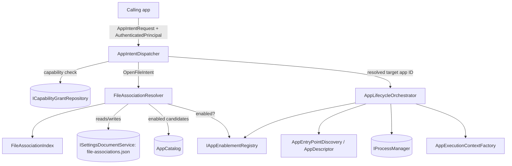

# App Lifecycle Orchestration, Typed Intent Dispatch, and File Associations

**Task list section:** [`integration-task-list.md` § 8](integration-task-list.md)
(`P1-APP-001` through `P1-APP-012`).
**Status:** Complete for Phase 1 scope. 254 solution tests passing (15 covering
this section directly).

## Purpose

Section 8 is the mechanism/policy split that turns a validated `AppCatalog`
entry into a running process, and turns a cross-app request ("open this file",
"run this command", "launch that app") into either a launched process or a
stable, inspectable denial/chooser outcome — mirroring how a real OS separates
process creation (`exec`) from request routing (a shell, `xdg-open`, or
`mimeopen`).

- **`AppLifecycleOrchestrator`** is the *mechanism* layer: given an app ID and
  an already-authenticated `AuthenticatedPrincipal`, it starts/stops Terminal,
  Service, and Window app instances, enforces singleton-window focus, and
  handles enable/disable cascades. It does **not** decide whether the caller
  is *allowed* to launch that app.
- **`AppIntentDispatcher`** is the *policy* layer above it: it capability-gates
  each typed `IAppIntent` (`LaunchAppIntent`, `OpenFileIntent`,
  `ExecuteCommandIntent`, `RevealFileIntent`, `ShowAppSettingsIntent`) before
  ever calling the orchestrator.
- **`FileAssociationResolver`** resolves an `OpenFileIntent` to a concrete
  target app ID using the canonical, protected
  `/etc/hackeros/file-associations.json` settings document (never a duplicate
  registry) plus enabled Window manifests' declared `FileHandlers`.

## Architecture

### Key classes

| Class | Location | Role |
|---|---|---|
| `AppLifecycleOrchestrator` | `Platform/HackerOs.Platform.Core/Lifecycle/AppLifecycleOrchestrator.cs` | Launches Terminal (synchronous, captures stdout/stderr/exit code), Service (background, ordered start/stop), and Window (singleton focus) app instances; `DisableAsync`/`Enable` with dependency-cascade shutdown. |
| `AppEnablementRegistry` | same folder | Tracks disabled app IDs and computes dependency closures. `IAppEnablementRegistry` (read-only: `IsEnabled`, closure queries) is the public contract; `MarkDisabled`/`MarkEnabled` are public mutators on the concrete class reserved for the orchestrator (and test fixtures) rather than arbitrary callers. |
| `AppIntentDispatcher` | `Platform/HackerOs.Platform.Core/Intents/AppIntentDispatcher.cs` | Capability-gates and routes every `IAppIntent` to the orchestrator or resolver; returns a stable `AppIntentDispatchResult`/`AppIntentDispatchStatus` (`Dispatched`, `CapabilityDenied`, `NotFound`, `Disabled`, `ChooserRequired`, `TargetInvalid`, `EntryPointFault`). Requires `AppCapabilities.AppsLaunch` for launch/open-file/execute-command; `RevealFileIntent`/`ShowAppSettingsIntent` require no capability. |
| `FileAssociationResolver` | `Platform/HackerOs.Platform.Core/Intents/FileAssociationResolver.cs` | Resolves `OpenFileIntent` → target app ID with precedence: explicit valid `PreferredAppId` → configured default in `file-associations.json` → sole enabled candidate → chooser-required (multiple candidates) → no-handler. |
| `FileAssociationIndex` | `Platform/HackerOs.Platform.Core/Intents/FileAssociationIndex.cs` | Rebuildable lookup from normalized file extension/media type/action to configured default app ID, parsed from the association document. |
| `FileAssociationSettingsDocuments` | `Platform/HackerOs.Platform.Core/Intents/FileAssociationSettingsDocuments.cs` | Canonical path (`/etc/hackeros/file-associations.json`), default seed content, JSON schema validator, and `SettingsDocumentDefinition` (read: `AppAuthority.User` + `AppCapabilities.FileAssociationsRead`; write: `AppAuthority.Administrator` + `AppCapabilities.FileAssociationsWrite`). |

## Key decisions

- **Read vs. write authority are deliberately asymmetric.** Resolving file
  associations is a routine operation every app performs when opening a file,
  so `MinimumReadAuthority = AppAuthority.User`. Only *changing* the configured
  default requires `AppAuthority.Administrator`. (An earlier draft set both to
  `Administrator`, which silently broke default resolution for ordinary users —
  see the repo memory note under "SettingsDocumentDefinition read vs write
  authority" for the failure mode and how it was diagnosed.)
- **Dispatcher vs. orchestrator split keeps policy and mechanism independently
  testable.** `AppLifecycleOrchestratorTests` exercises launch/stop/singleton/
  fault/disable mechanics directly (no capability checks); `AppIntentDispatcherTests`
  exercises capability gating and intent routing against a real orchestrator +
  resolver + catalog.
- **`ExecuteCommandIntent` resolves by Terminal manifest command name or alias**,
  not by app ID, mirroring a real shell's `$PATH` command lookup.
- **`RevealFileIntent` and `ShowAppSettingsIntent` are intentionally
  no-op-ish today** — actually focusing a file manager selection or rendering
  a settings surface belongs to the future window runtime (Phase 2A); Section
  8 only validates the target and acknowledges the request.

## Tests

- `Tests/HackerOs.Platform.Core.Tests/Lifecycle/AppLifecycleOrchestratorTests.cs` —
  Terminal/Service/Window launch, singleton focus, not-found, disabled,
  entry-point fault, dependency-cascade disable.
- `Tests/HackerOs.Platform.Core.Tests/Intents/FileAssociationResolverTests.cs` —
  explicit target (valid/invalid/disabled), configured default, sole candidate,
  chooser-required, no-handler.
- `Tests/HackerOs.Platform.Core.Tests/Intents/AppIntentDispatcherTests.cs` —
  capability-gated launch, execute-command by name/alias/unknown, open-file
  sole-candidate and chooser-required, reveal-file/show-settings no-capability
  paths.

## Task list

See [`integration-task-list.md` § 8](integration-task-list.md) — all of
`P1-APP-001` through `P1-APP-012` are checked off.
